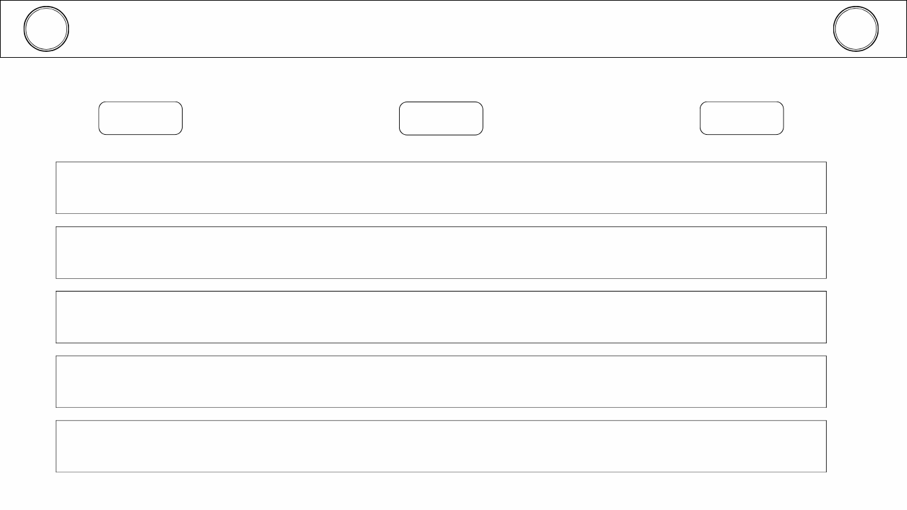
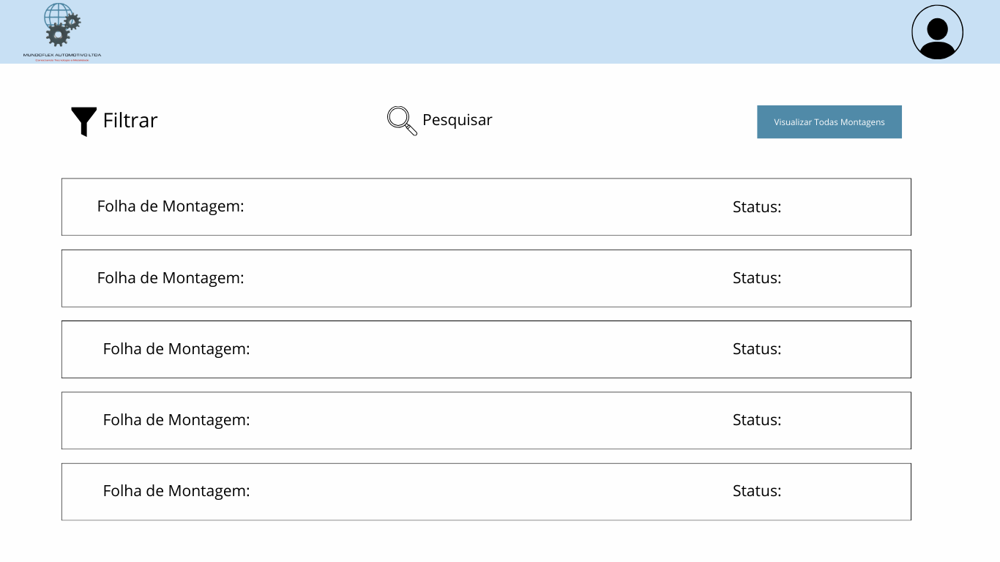

Escopo do Projeto: Sistema de Gerenciamento de Folhas de Montagem para MUNDOFLEX

1. Objetivo Geral

Desenvolver um aplicativo web para a MUNDOFLEX que permita aos administradores gerenciar o status de disponibilidade das folhas de montagem e possibilite aos usuários comuns consultar o status dessas folhas de forma intuitiva e eficiente.

2. Objetivos Específicos

Implementar uma interface administrativa para gerenciamento de folhas de montagem, incluindo status e informações relevantes.
Oferecer uma interface para os usuários comuns consultarem o status das folhas de montagem.
Garantir que o sistema permita a atualização e a consulta dos status em tempo real.
Assegurar que o sistema tenha um nível adequado de segurança para proteger dados sensíveis.
Fornecer relatórios sobre o uso e status das folhas de montagem.

3. Requisitos Funcionais

Autenticação e Autorização:

O sistema deve permitir login e cadastro para administradores e usuários comuns.
Administradores terão permissões para gerenciar o status das folhas de montagem, enquanto usuários comuns terão apenas permissões de consulta.
Utilização de JWT para autenticação segura.
Gestão de Folhas de Montagem:

Adicionar, editar e excluir folhas de montagem.
Atualizar o status das folhas de montagem (ex.: Disponível, Em uso, Aguardando revisão).
Associar informações relevantes às folhas de montagem (ex.: data de criação, responsável, observações).
Consulta de Status:

Interface para os usuários comuns consultarem o status atual das folhas de montagem.
Filtros para pesquisa por status, data e outras informações relevantes.
Relatórios e Visualizações:

Relatórios sobre o status das folhas de montagem por período, tipo e disponibilidade.
Visualizações gráficas do status das folhas ao longo do tempo.
Notificações:

Alertas sobre mudanças de status das folhas de montagem.
Notificações sobre alterações relevantes que possam impactar os usuários.

4. Requisitos Não Funcionais

Segurança:

Conexão segura com o banco de dados utilizando TLS/SSL.
Autenticação e autorização utilizando JWT para garantir segurança no acesso.
Escalabilidade:

Arquitetura modular que permita a adição de novas funcionalidades sem comprometer o desempenho existente.
Performance:

Tempo de resposta inferior a 2 segundos para a maioria das consultas e atualizações.
Otimização de consultas ao banco de dados para melhorar o desempenho.
Usabilidade:

Interface intuitiva e fácil de usar tanto para administradores quanto para usuários comuns.
Layout responsivo e acessível em diferentes dispositivos (desktop e mobile).

5. Objetivos SMART

Específico (Specific): Desenvolver um sistema web que permita aos administradores gerenciar o status das folhas de montagem e aos usuários comuns consultar esse status de maneira eficiente e segura.

Mensurável (Measurable): O sistema deverá suportar até 500 folhas de montagem simultaneamente e permitir atualizações de status em tempo real com uma precisão de 95% na visualização dos dados.

Atingível (Achievable): Utilizando tecnologias como Node.js, React e MongoDB, o sistema será desenvolvido em um prazo de 10 semanas, com entrega de um MVP (Produto Mínimo Viável) ao final da 6ª semana e ajustes e melhorias nas semanas subsequentes.

Relevante (Relevant): O sistema é crucial para a MUNDOFLEX, pois otimiza o gerenciamento e consulta de folhas de montagem, facilitando a administração e acesso à informação para ambos administradores e usuários.

Temporal (Time-bound): O sistema completo será desenvolvido e entregue em 10 semanas, com funcionalidades principais (login, gerenciamento de folhas e consulta de status) disponíveis até a 6ª semana, e o módulo de relatórios finalizado até a 8ª semana.

6. Cronograma

Semana 1-2: Análise de Requisitos e Prototipação do Design (UI/UX)
Semana 3-4: Configuração do ambiente de desenvolvimento, criação da estrutura do projeto (Node.js, MongoDB, React)
Semana 5-6: Implementação de autenticação, gerenciamento de folhas de montagem e funcionalidades básicas
Semana 7-8: Desenvolvimento do módulo de consulta de status e relatórios
Semana 9: Testes de segurança, performance e usabilidade
Semana 10: Entrega, feedback e ajustes finais

7. Análise de Riscos

Falha na Segurança dos Dados: Acesso indevido a informações sensíveis.

Probabilidade: Alta
Impacto: Muito alto
Mitigação: Criptografia de senhas (bcrypt), autenticação JWT, conexões HTTPS
Perda de Dados: Perda de folhas de montagem ou informações associadas.

Probabilidade: Moderada
Impacto: Alto
Mitigação: Backups automáticos e replicação no MongoDB
Desempenho Degradado: Lentidão com aumento do número de folhas de montagem.

Probabilidade: Moderada
Impacto: Moderado
Mitigação: Otimização de consultas e uso de caching (Redis)
Estouro de Prazo: Atrasos no desenvolvimento.

Probabilidade: Moderada
Impacto: Alto
Mitigação: Cronograma claro e entregas iterativas

8. Recursos Necessários

Tecnológicos:

Node.js: Backend para gerenciamento de folhas de montagem e autenticação
React: Frontend para interface de usuário
MongoDB: Banco de dados NoSQL para armazenamento de dados
JWT (JSON Web Tokens): Autenticação segura
Git/GitHub: Controle de versão
Equipe:

Desenvolvedor Full-Stack: Implementação e integração do frontend e backend
Especialista em Segurança: Garantia de criptografia e segurança dos dados
Designer UI/UX: Desenvolvimento da interface amigável
Gerente de Projeto: Coordenação do cronograma e progresso
Tester/QA: Testes de usabilidade, performance e segurança
Ferramentas de Desenvolvimento:
VSCode

Treinamento: Capacitação dos usuários finais
Suporte Técnico: Manutenção e atualizações pós-implantação
Orçamento:

Licenças e Infraestrutura: Custos com hospedagem, ferramentas de desenvolvimento e segurança
Desenvolvimento: Custo da equipe técnica

