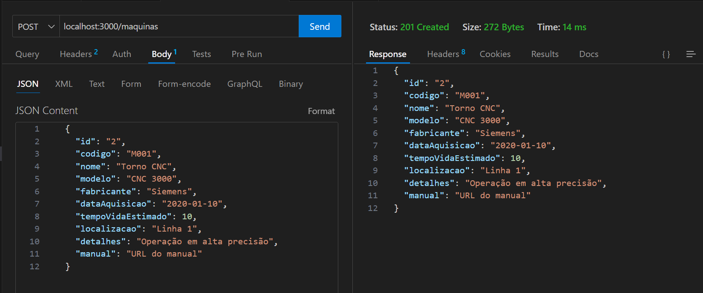

# Documentação Técnica do Projeto

## 1. Definição do Projeto

O Sistema de Manutenção Preventiva e Corretiva é um software destinado ao gerenciamento do ciclo de vida de máquinas e equipamentos industriais, com foco em minimizar o tempo de inatividade e otimizar a performance operacional. Ele permite o controle das manutenções preventivas (realizadas regularmente para evitar falhas) e corretivas (realizadas após uma falha). O sistema também inclui funcionalidades para registrar falhas, gerenciar técnicos, gerar relatórios e acompanhar indicadores de desempenho, como o MTTR (Mean Time to Repair - Tempo Médio de Reparo) e o MTBF (Mean Time Between Failures - Tempo Médio Entre Falhas).

## 2. Análise de Requisitos e Escopo

### Funcionalidades Principais:
- **Gerenciamento de Máquinas e Equipamentos:**
  - Cadastro de máquinas, incluindo especificações técnicas, data de aquisição e localização.
  - Visualização e edição de informações de máquinas.

- **Registro e Controle de Manutenções:**
  - Registro de manutenções preventivas e corretivas.
  - Histórico completo de manutenções para cada máquina.
  - Registro de peças substituídas e tempo de inatividade.

- **Gerenciamento de Falhas:**
  - Registro de falhas ocorridas, classificando a severidade e identificando o operador.
  - Controle de falhas por máquina.

- **Gerenciamento de Técnicos:**
  - Cadastro de técnicos, incluindo suas especialidades e disponibilidade.

- **Relatórios e Indicadores:**
  - Geração de relatórios de manutenção, tempo de inatividade, falhas e peças trocadas.
  - Cálculo de indicadores como MTTR e MTBF.

- **Integração com API:**
  - Utilização de uma API REST (JSON-Server) para armazenar e recuperar dados.

### Requisitos Funcionais:
- O sistema deve permitir o cadastro de máquinas com suas especificações.
- O sistema deve registrar manutenções preventivas e corretivas, associando técnicos e peças trocadas.
- O sistema deve gerar relatórios de manutenção e indicadores de performance.
- O sistema deve oferecer uma interface gráfica intuitiva para o usuário final.

### Requisitos Não Funcionais:
- O sistema deve ser responsivo, com tempo de resposta rápido ao realizar operações com a API.
- A interface deve ser amigável e permitir fácil navegação entre as funcionalidades.
- O sistema deve armazenar e recuperar dados de maneira segura e eficiente.

## 3. Escopo do Projeto

### 3.1 Objetivos:
- Desenvolvimento da interface gráfica (Swing) para o gerenciamento de máquinas, técnicos e manutenções.
- Implementação de funcionalidades CRUD para máquinas, manutenções, falhas e técnicos.
- Geração de relatórios com base nos dados registrados, incluindo indicadores de desempenho.
- Conexão com API para armazenar e manipular dados em tempo real.
- Validação e testes para garantir a robustez do sistema.

### 3.2 Levantamento de Recursos:
#### Equipe de Desenvolvimento:
- **1 Gerente de Projeto:** Responsável pela coordenação do projeto, prazos e comunicação com stakeholders.
- **1 Desenvolvedor Java:** Especializado em desenvolvimento com Maven e Swing para a implementação das funcionalidades.
- **1 Designer de UI/UX:** Para criar uma interface gráfica intuitiva e amigável.
- **1 Analista de QA:** Para conduzir testes e garantir a qualidade do software.

#### Infraestrutura:
- **Ambiente de Desenvolvimento:**
  - Suporte a Maven.
  - Sistema de controle de versão (Git).
  
- **Banco de Dados:**
  - Banco de dados não relacional (JSON) para armazenamento dos dados.

- **Serviço de API:**
  - Implementação de uma API REST utilizando JSON-Server ou outra tecnologia adequada.

#### Ferramentas:
- **Ferramentas de Gerenciamento de Projetos:** Trello, Jira ou similar para acompanhamento de tarefas e progresso.
- **Ferramentas de Teste:**
  - JUnit para testes unitários.
  - Selenium para testes de interface, se necessário.

#### Documentação:
- Documentação de requisitos e especificações.
- Manual do usuário e documentação técnica.

#### Treinamento:
- Capacitação da equipe nas tecnologias utilizadas.
- Treinamento dos usuários finais para utilização eficaz do sistema.

## 3.3 Riscos Técnicos:

### Dificuldades na Integração da API:
**Solução:** Além de realizar testes de integração durante o desenvolvimento, criar um protótipo de integração inicial para verificar a funcionalidade da API em um ambiente controlado. Documentar todas as interações e manter uma comunicação constante com o fornecedor da API para resolver problemas rapidamente.

### Desempenho do Sistema:
**Solução:** Implementar monitoramento em tempo real do desempenho do sistema para identificar gargalos. Realizar otimizações contínuas e revisar a arquitetura do banco de dados para garantir que ele suporte a carga prevista. Utilizar cache para melhorar a resposta do sistema e reduzir a carga em consultas frequentes.

## Riscos de Prazo:

### Atrasos na Entrega:
**Solução:** Adotar uma abordagem de planejamento mais flexível, como a metodologia Scrum, permitindo ajustes no backlog com base no progresso e feedback contínuo. Realizar reuniões diárias de stand-up para monitorar o progresso e abordar rapidamente quaisquer impedimentos que possam causar atrasos.

## Riscos de Qualidade:

### Bugs no Sistema:
**Solução:** Implementar uma cultura de qualidade que envolva todos os membros da equipe, desde o planejamento até a entrega. Utilizar ferramentas de integração contínua (CI) para automatizar testes e garantir que novos códigos não quebrem funcionalidades existentes. Realizar revisões de código regulares e incentivar a colaboração entre os desenvolvedores.

## Riscos Humanos:

### Falta de Experiência da Equipe:
**Solução:** Além de treinamentos e mentorias, criar um ambiente de aprendizado contínuo. Incentivar a participação em workshops, conferências e cursos online. Estabelecer pares de programação (pair programming) para facilitar o aprendizado prático e promover a troca de conhecimentos entre membros da equipe.

## Riscos de Adoção:

### Resistência dos Usuários Finais:
**Solução:** Desenvolver um programa de mudança que inclua a comunicação clara dos benefícios do novo sistema. Realizar sessões de demonstração e pilotagem com um grupo seleto de usuários, coletando feedback e ajustando o sistema conforme necessário. Criar uma linha de suporte dedicada para resolver dúvidas e preocupações dos usuários durante o processo de adoção.

